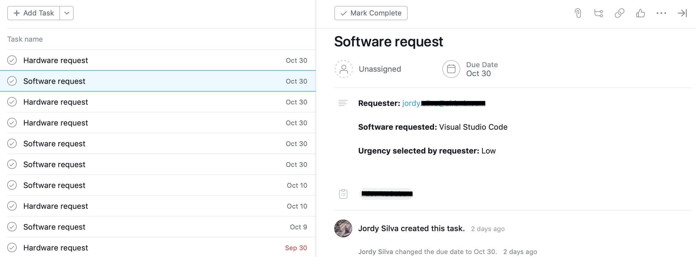
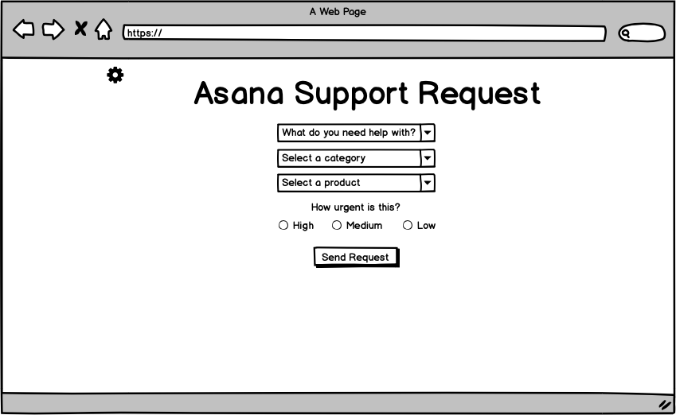
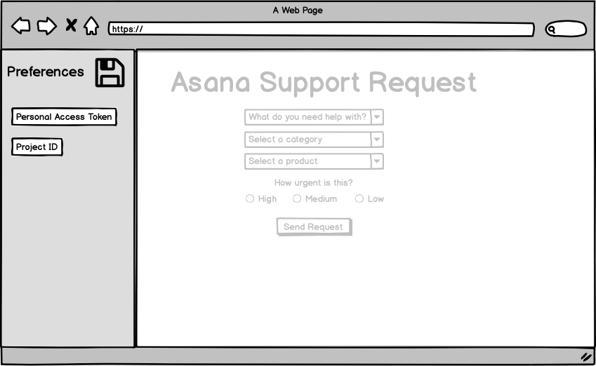

# Asana Service Desk App

Milestone Project - Interactive Frontend Development - Code Institute

**FOR EDUCATIONAL PURPOSE ONLY**

The customer is the IT department of a small size company. Currently they use Asana to record requests for new software and hardware from the company's employees. Those requests arrive by email, slack, walk-ins, and any imaginable or unimaginable form of communication. An IT intern transcripts those requests into an Asana task and assigns it to an Asana project that is used as 'queue' of requests. IT staff work out of that 'queue' (Asana project) and assign the task to themselves to complete the request. The IT department management request is to automate the creation of those Asana tasks via a self-serve online solution that the company's employees can use to send their requests, so the intern can focus again on preparing coffee.

The solution proposed is an online minimalistic app consisting of a form that captures all the information needed by the IT department and leverages the Asana API to automatically create the task in the assigned Asana project (queue).
 
## UX
### User Stories

- As employee, I want to be able to quickly submit my requests at any time, so I can focus on my work
    - **Feature:** Online form available 24x7

- As employee, I want to easily know what options are available to me, so I can find what I need
    - **Feature:** Intake form divided in 3 dropdowns, dependent between them and organized in categories

- As IT manager, I want to be able to configure to what Asana project tasks will go, so I can follow our processes
    - **Feature:** Side bar to configure Asana Personal Access Token and Asana target project

- As IT staff, I want to clearly see all details of the request, so I can be effective in my work
    - **Feature:** Created task includes type of request in the title and the body is rich formatted for easy reading

- As IT staff, I want to see the deadline to complete the request according to the urgency selected by the submitter, so I can prioritize work
    - **Feature:** The Asana task is created with a due date dependant on the priority selected by the user. High: Tomorrow, Medium: Today + 7 days, Low: Today + 30 days

### Example of task created by the app

### Wireframes
For the skeleton element of the UX design of this project, the [balsamiq.cloud](https://balsamiq.cloud) tool was used to create the wireframes.
 

## Features
The site is responsive and mobile first, even if due to the simplicity achieved on the User Interface there's little difference between different screen sizes.

A collapsible side bar has been implemented for IT managers to set the preferences for the app to work. Those preferences are stored on the client browser using Web Storage.

Preferences values are auto-saved upon input, so it is not required for the user to pro-actively save them once entered.

### Features Left to Implement
#### Preferences panel should only be accessible to IT managers.
This could be achieved by implementing OAuth 2.0 authentication which is supported by Asana API and the preferred solution. An alternative solution could be passing a token as argument in the URL that, when present, would enable the sidebar.

#### Preferences should be stored in a DB server side.
For releasing this app to the public preferences should be stored in server side instead of user browser as customers shouldn't need to do any configuration, neither have access to those.

#### Dropdown for Target Project ID
The current preferences field **Target Project ID** could be a dropdown that auto-populates with the projects of the admin that is logged in (given the authentication feature has been implemented) so there's no need to find the project ID in the Asana app website.

## Technologies Used

1. HTML
2. CSS
3. JavaScript
3. Bootstrap (v4.3.1) https://getbootstrap.com
4. jQuery (v.3.4.1)
5. Asana REST API

## Testing

The site has been tested in multiple browsers (Chrome, Chromium, Safari, FireFox), in multiple OS (MacOS, Linux, Windows 10) and on multiple mobile devices (Android 7 phone & iPad mini) to ensure compatibility and responsiveness.

The following manual tests have been carried out:
- Load site without Asana Personal Access Token, without Asana target project, or any combination of the two
- Submit form without all the fields filled
- Submit form with invalid values in preferences
- Try all combinations of request type + category in the dropdown menus

All user stories have been checked to confirm the website offers a solution to them.

## Deployment

This site is hosted using GitHub pages, deployed directly from the master branch. The deployed site will update automatically upon new commits to the master branch. In order for the site to deploy correctly on GitHub pages, the landing page must be named index.html

In order for the app to be functional you need to have an Asana account (free) and setup your **Asana Personal Access Token** and **Target Asana project ID** in the app.

### Deployment steps:
1. In the GitHub repository page, click **Settings**
2. Scroll down to the section **GitHub Pages**
3. Select from the dropdown the branch to publish. Usually **master branch**
4. At the top of the **GitHub Pages** section you will find the URL of the deployed site

### Setting up Asana
1. Create an [Asana Account](https://asana.com) if you don't have one
2. Create a **Personal Access Token**
    - Log into your Asana account
    - Click your profile photo in the upper right side of the screen
    - Click **My Profile Settings**
    - Click **Apps**
    - Click **Manage Developer Apps**
    - Click **+ New Access Token**
    - Enter a name for your token so you know what's used for. Then tick the box to accept the *terms & conditions*. Finally click **Create Token**
    - Copy the token in a safe place as **you won't see it ever again!**
    - Go to your Asana Service Desk app and open the preferences panel.
    - Enter the token in the field **Asana Personal Access Token**
3. Create a project in Asana if you don't have one
    - Navigate to your project and make sure you don't have any task selected
    - Find the project ID in the URL. For example if your URL is `https://app.asana.com/0/640588378521886/list`then the Asana project ID is **640588378521886**
    - Go to your Asana Service Desk app and open the preferences panel.
    - Enter the Asana project ID in the field **Target Asana Projec ID**

### To run locally
You can clone this repository by typing `git clone https://github.com/jordy-silva/ci-asana-service-desk-msp.git` into your terminal, given that git is installed in your machine. You will need a webserver in your machine that points at index.html as main page.

## Credits

### Content
- Text from the *Deployment* section of this document has been copied and adapted from Code Institute's [example project](https://github.com/Code-Institute-Solutions/StudentExampleProjectGradeFive/blob/master/README.md)

### Acknowledgements
- StackOverflow was consulted for help with different challenges during the project.
- Bootstrap documentation and examples have been used as base for some parts of the website.
- Asana JavaScript API documentation has been used as reference to implement that functionality.
https://github.com/Asana/node-asana & https://asana.com/developers/api-reference/attachments
- How to create a collapsable sidebar (which is not natively supported by Bootstrap) was found here: https://bootstrapious.com/p/bootstrap-sidebar (JavaScript code from the source is directly used and placed on standalone file)
- How to implement placeholders in select form elements was inspired from here: https://stackoverflow.com/questions/5805059/how-do-i-make-a-placeholder-for-a-select-box
